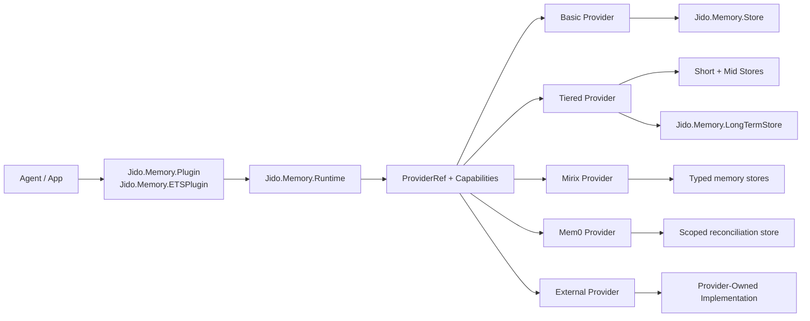
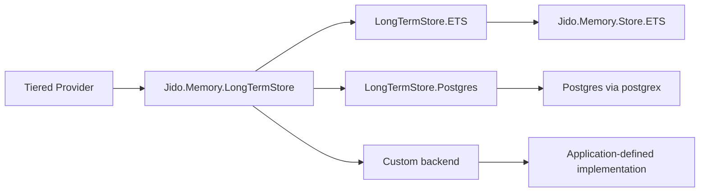

# Current Architecture Topology

This document describes the implemented topology of `jido_memory` after the
provider rollout and follow-on phases.

It is a support document for the Spec Led workspace, not a current-truth subject
in `.spec/specs/`.

## Topology Summary

`jido_memory` is the unified Jido-facing memory package.

The implemented architecture has five main layers:

1. Agent-facing integration through `Jido.Memory.Plugin` and compatibility `Jido.Memory.ETSPlugin`
2. Common runtime and action facade through `Jido.Memory.Runtime`
3. Provider selection and capability negotiation through `Jido.Memory.ProviderRef` and `Jido.Memory.Capabilities`
4. Built-in and external provider implementations
5. Storage substrates for short, mid, and long-term memory

## High-Level Runtime Topology

## Built-In Provider Topology

```mermaid
flowchart TB
    Runtime["Jido.Memory.Runtime"] --> Basic["Jido.Memory.Provider.Basic"]
    Runtime --> Tiered["Jido.Memory.Provider.Tiered"]
    Runtime --> Mirix["Jido.Memory.Provider.Mirix"]
    Runtime --> Mem0["Jido.Memory.Provider.Mem0"]

    Basic --> SingleStore["Single Jido.Memory.Store backend"]

    Tiered --> Short["Short tier"]
    Tiered --> Mid["Mid tier"]
    Tiered --> Long["Long tier"]
    Tiered --> Explain["Explainable retrieval"]
    Tiered --> Lifecycle["Lifecycle inspection + consolidate"]

    Short --> StoreShort["Jido.Memory.Store"]
    Mid --> StoreMid["Jido.Memory.Store"]
    Long --> LongStore["Jido.Memory.LongTermStore"]

    Mirix --> Core["Core store"]
    Mirix --> Episodic["Episodic store"]
    Mirix --> Semantic["Semantic store"]
    Mirix --> Procedural["Procedural store"]
    Mirix --> Resource["Resource store"]
    Mirix --> Vault["Vault store"]
    Mirix --> Active["Active retrieval explanations"]
    Mirix --> Direct["Provider-direct ingest + vault APIs"]

    Mem0 --> Mem0Facts["Scoped fact store"]
    Mem0 --> Mem0Explain["Scoped retrieval + graph explanations"]
    Mem0 --> Mem0Direct["Provider-direct ingest + maintenance APIs"]
```

## Long-Term Storage Topology

## Capability Topology

Required core path:

- `remember/3`
- `get/3`
- `retrieve/3`
- `forget/3`
- `prune/2`
- `info/2`

Optional capability path:

- `Lifecycle`
- `ExplainableRetrieval`
- `Operations`
- `Governance`
- `TurnHooks`

Current built-in support:

| Path | Core | Explainability | Lifecycle | Durable Long-Term | Ingestion | Protected Memory |
| --- | --- | --- | --- | --- | --- | --- |
| `:basic` | yes | no | no | no | no | no |
| `:tiered` + ETS long-term | yes | yes | yes | ETS only | no | no |
| `:tiered` + Postgres long-term | yes | yes | yes | yes | no | no |
| `:mirix` | yes | yes | no | ETS-backed typed stores | provider-direct | provider-direct |
| `:mem0` | yes | yes | no | scoped ETS-backed store | provider-direct | no |
| External reference path | yes | provider-specific | provider-specific | provider-specific | provider-specific | provider-specific |

## Boundary With `jido_memory_os`

`jido_memory_os` is not part of the built-in topology.

Current boundary:

- `jido_memory` owns the common runtime, plugin, provider contract, built-in providers, and long-term backend seam
- `jido_memory_os` remains a standalone advanced library for manager-driven workflows such as journaling, replay, and governance-heavy orchestration

## Release-Gated Paths

The release-gated matrix currently includes:

- built-in `:basic`
- built-in `:tiered` with ETS long-term storage
- built-in `:tiered` with Postgres long-term storage
- built-in `:mem0`
- built-in `:mirix`
- the external-provider reference path

Reference material:

- `.spec/specs/provider_architecture.spec.md`
- `docs/rfcs/0001-canonical-memory-provider-architecture.md`
- `docs/guides/05_release_support_matrix.md`
