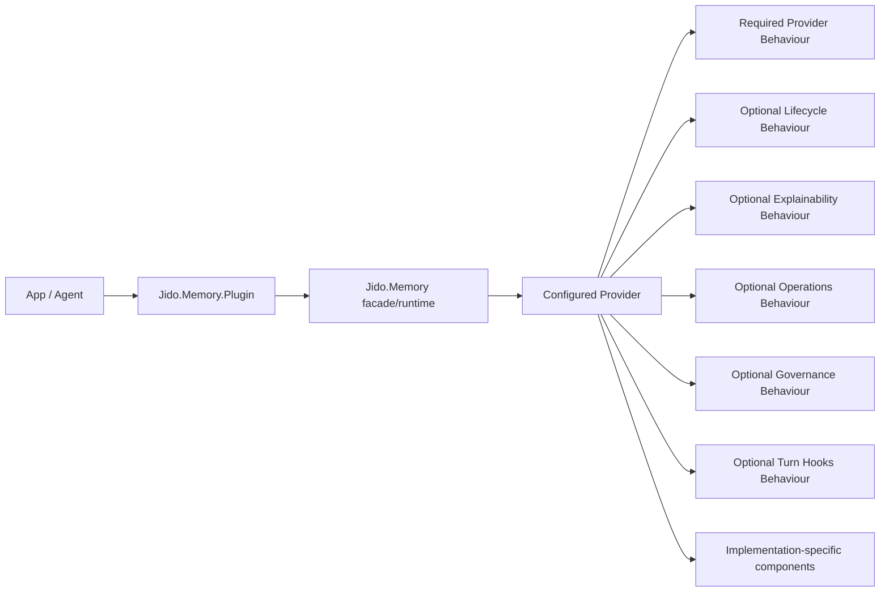

# RFC 0001: Canonical Memory Provider Architecture

- Status: Draft
- Date: 2026-03-21
- Target library: `jido_memory`

## Summary

This RFC proposes that `jido_memory` become the canonical memory contract layer for
Jido agents.

<!-- covers: jido_memory.provider_architecture.contract_owner -->
<!-- covers: spec.workspace.current_truth_boundary -->

Instead of treating `jido_memory_os` as the place where the full memory abstraction
lives, we define a stable provider architecture in `jido_memory` so applications can
choose a memory implementation at configuration time:

- a minimal provider backed by the current `Jido.Memory.Runtime` and `Jido.Memory.Store`
- an advanced provider backed by `jido_memory_os`
- future providers such as graph, vector, remote-service, or domain-specific memory systems

The design centers on:

- a required core provider behaviour
- optional capability behaviours
- a stable plugin/actions facade in `jido_memory`
- provider bundles as the main external swap point
- implementation-specific composition behind the provider boundary

<!-- covers: jido_memory.provider_architecture.core_plus_capabilities -->
<!-- covers: jido_memory.provider_core.provider_bundle_selection -->
<!-- covers: jido_memory.provider_capabilities.optional_behaviours -->

## Motivation

Today the two libraries split responsibilities in a useful but incomplete way:

- `jido_memory` already owns the canonical record and store substrate:
  - `Jido.Memory.Record`
  - `Jido.Memory.Query`
  - `Jido.Memory.Store`
  - `Jido.Memory.Runtime`
- `jido_memory_os` adds advanced orchestration:
  - tiered memory
  - control plane
  - explainable retrieval
  - governance
  - journaling and replay
  - migration and rollout support

This leaves a gap:

- the stable data model lives in `jido_memory`
- the advanced memory operating model lives in `jido_memory_os`
- but there is no canonical contract that says "a Jido memory implementation must satisfy these
  behaviours to plug into agents and tools"

As a result:

- plugin and action APIs diverge
- implementation choice leaks into app architecture
- advanced features are difficult to negotiate safely
- other memory implementations would have to invent their own facades

This RFC makes `jido_memory` the canonical home for the shared memory contract while
keeping `jido_memory_os` as an advanced provider, not the standard itself.

## Goals

- Define a stable agent-facing memory contract in `jido_memory`
- Allow applications to select a memory provider by configuration
- Preserve `Jido.Memory.Record` as the canonical shared record model
- Keep the common plugin/actions surface stable across providers
- Support optional advanced capabilities without forcing every provider to implement them
- Enable `jido_memory_os` to plug in cleanly as one provider
- Leave room for future providers that do not use tiers internally

## Non-Goals

- Standardizing one internal memory layout for all providers
- Requiring every provider to implement tiering, replay, governance, or explainability
- Merging `jido_memory_os` into `jido_memory`
- Replacing the existing `Jido.Memory.Store` abstraction in the first step
- Solving vector retrieval, graph retrieval, and lifecycle strategies in this RFC

## Design Principles

### 1. Standardize operations, not internals

The common contract should express what a memory implementation can do, not how it stores
or organizes memory.

This is important because:

- the current `jido_memory` model is flat and namespace-based
- `jido_memory_os` is tiered and lifecycle-driven
- future providers may be graph-based, vector-first, or remote

### 2. Bundle-first, component-second

The main public swap point should be the provider bundle:

- `Basic`
- `MemoryOS`
- `GraphMemory`
- `RemoteMemory`

Within a provider, internal composition can remain modular:

- storage backend
- retrieval planner
- ranking module
- governance module
- journal module

This avoids exposing a fragile compatibility matrix to applications too early.

### 3. Capabilities over one giant interface

Every provider should satisfy the same core contract.
Advanced features should be negotiated by capability, not forced into one oversized behaviour.

### 4. Behaviours over protocols

Provider selection is configuration-driven, not data-type-driven.
That makes Elixir behaviours the right abstraction, while protocols would be the wrong fit.

## Proposed Architecture



## Proposed Modules

### Required

- `Jido.Memory.Provider`
- `Jido.Memory.Provider.Basic`

### Optional capability behaviours

- `Jido.Memory.Capability.Lifecycle`
- `Jido.Memory.Capability.ExplainableRetrieval`
- `Jido.Memory.Capability.Operations`
- `Jido.Memory.Capability.Governance`
- `Jido.Memory.Capability.TurnHooks`

### Supporting modules

- `Jido.Memory.ProviderRef`
- `Jido.Memory.Capabilities`
- `Jido.Memory.Error.UnsupportedCapability`

## Required Provider Behaviour

The core behaviour should cover the minimum contract that all memory systems can reasonably satisfy.

<!-- covers: jido_memory.provider_core.required_behaviour -->
<!-- covers: jido_memory.provider_core.bootstrap_boundary -->

```elixir
defmodule Jido.Memory.Provider do
  alias Jido.Memory.Query
  alias Jido.Memory.Record

  @type target :: map() | struct()
  @type provider_meta :: map()

  @callback validate_config(keyword()) :: :ok | {:error, term()}
  @callback child_specs(keyword()) :: [Supervisor.child_spec()]
  @callback init(keyword()) :: {:ok, provider_meta()} | {:error, term()}
  @callback capabilities(provider_meta()) :: map()

  @callback remember(target(), map() | keyword(), keyword()) ::
              {:ok, Record.t()} | {:error, term()}

  @callback get(target(), String.t(), keyword()) ::
              {:ok, Record.t()} | {:error, term()}

  @callback retrieve(target(), Query.t() | map() | keyword(), keyword()) ::
              {:ok, [Record.t()]} | {:error, term()}

  @callback forget(target(), String.t(), keyword()) ::
              {:ok, boolean()} | {:error, term()}

  @callback prune(target(), keyword()) ::
              {:ok, non_neg_integer()} | {:error, term()}

  @callback info(provider_meta(), :all | [atom()]) :: {:ok, map()} | {:error, term()}
end
```

### Rationale

- `child_specs/1` lets advanced providers bring their own supervision tree
- `init/1` returns provider metadata that the plugin/runtime can retain
- `capabilities/1` gives a structured way to expose supported features
- `info/2` gives one stable place for implementation metadata and health

## Optional Capability Behaviours

<!-- covers: jido_memory.provider_capabilities.optional_behaviours -->

### Lifecycle

```elixir
defmodule Jido.Memory.Capability.Lifecycle do
  @callback consolidate(map() | struct(), keyword()) ::
              {:ok, map()} | {:error, term()}
end
```

### Explainable Retrieval

```elixir
defmodule Jido.Memory.Capability.ExplainableRetrieval do
  @callback explain_retrieval(map() | struct(), term(), keyword()) ::
              {:ok, map()} | {:error, term()}
end
```

### Operations

```elixir
defmodule Jido.Memory.Capability.Operations do
  @callback metrics(keyword()) :: {:ok, map()} | {:error, term()}
  @callback audit_events(keyword()) :: {:ok, [map()]} | {:error, term()}
  @callback journal_events(keyword()) :: {:ok, [map()]} | {:error, term()}
  @callback cancel_pending(keyword()) :: {:ok, non_neg_integer()} | {:error, term()}
end
```

### Governance

```elixir
defmodule Jido.Memory.Capability.Governance do
  @callback issue_approval_token(keyword()) :: {:ok, map()} | {:error, term()}
  @callback current_policy(keyword()) :: {:ok, map()} | {:error, term()}
end
```

### Turn Hooks

```elixir
defmodule Jido.Memory.Capability.TurnHooks do
  @callback pre_turn(map() | struct(), keyword()) :: {:ok, map()} | {:error, term()}
  @callback post_turn(map() | struct(), keyword()) :: {:ok, map()} | {:error, term()}
end
```

## Capability Discovery

Providers should expose capabilities as structured data rather than a flat list of atoms.

<!-- covers: jido_memory.provider_capabilities.structured_discovery -->
<!-- covers: jido_memory.provider_capabilities.typed_unsupported_error -->

Example:

```elixir
%{
  core: true,
  retrieval: %{
    explainable: true
  },
  lifecycle: %{
    consolidate: true,
    tiers: true
  },
  governance: %{
    approvals: true,
    policy: true,
    masking: true,
    audit: true
  },
  operations: %{
    metrics: true,
    journal: true,
    replay: true,
    cancel_pending: true
  },
  hooks: %{
    pre_turn: true,
    post_turn: true
  }
}
```

The stable plugin/actions layer can use this to:

- expose routes only when supported
- return a typed unsupported-capability error
- surface provider metadata to tooling

## Plugin and Runtime Changes

`jido_memory` should own the stable plugin/actions facade.

<!-- covers: jido_memory.provider_facade.provider_configurable_plugin -->
<!-- covers: jido_memory.provider_facade.canonical_dispatch_boundary -->

### Proposed direction

- `Jido.Memory.Plugin` becomes provider-configurable
- existing ETS-oriented plugin behavior becomes the default `Basic` provider configuration
- actions call the canonical facade, not implementation-specific modules

Example configuration:

```elixir
{Jido.Memory.Plugin,
 %{
   provider: {Jido.Memory.Provider.Basic,
    store: {Jido.Memory.Store.ETS, [table: :agent_memory]}}
 }}
```

Advanced provider example:

```elixir
{Jido.Memory.Plugin,
 %{
   provider: {Jido.Memory.Providers.MemoryOS,
    config: %{
      tiers: %{...},
      governance: %{...}
    }}
 }}
```

## Query and Record Contract

<!-- covers: jido_memory.provider_facade.shared_record_query_contract -->

### Record

`Jido.Memory.Record` should remain canonical.

Provider-specific metadata should continue to live under `record.metadata`, using namespaced keys.
For example:

- `"memory_os"`
- `"provider"`
- `"retrieval"`

This keeps the shared record envelope stable even as implementations vary.

### Query

`Jido.Memory.Query` should remain the canonical base query.

Provider-specific query features should not become mandatory core fields.
Instead, advanced implementations should use one of these paths:

- provider-specific options in `opts`
- additive `:hints` or `:extensions` fields introduced in a backward-compatible way

This matters because features like `tier_mode` are valuable but not universal.

## How Existing Libraries Map

### `jido_memory`

`jido_memory` becomes:

- the canonical contract owner
- the home of the stable plugin/actions facade
- the home of the default `Basic` provider

The `Basic` provider can be very thin:

- use `Jido.Memory.Runtime`
- use `Jido.Memory.Store`
- return no child specs
- expose only core capabilities

<!-- covers: jido_memory.provider_migration.basic_provider_default -->

### `jido_memory_os`

`jido_memory_os` becomes a provider implementation that satisfies:

- `Jido.Memory.Provider`
- `Jido.Memory.Capability.Lifecycle`
- `Jido.Memory.Capability.ExplainableRetrieval`
- `Jido.Memory.Capability.Operations`
- `Jido.Memory.Capability.Governance`
- `Jido.Memory.Capability.TurnHooks`

Its current manager and workers can be surfaced through `child_specs/1`.

<!-- covers: jido_memory.provider_architecture.provider_roles -->
<!-- covers: jido_memory.provider_migration.memory_os_integration -->

## Composability Model

Externally, applications choose a provider bundle.
Internally, providers remain free to compose implementation-specific components.

Example internal composition for a future advanced provider:

```elixir
%{
  storage: MyStore,
  planner: MyPlanner,
  ranker: MyRanker,
  policy: MyPolicy,
  journal: MyJournal
}
```

This gives us modularity without requiring application authors to assemble memory systems from
five or six low-level parts.

## Migration Plan

### Phase 1: Introduce canonical provider behaviours in `jido_memory`

- add `Jido.Memory.Provider`
- add optional capability behaviours
- add unsupported-capability errors
- add capability discovery helpers

### Phase 2: Introduce a default `Basic` provider

- wrap current `Jido.Memory.Runtime` and `Jido.Memory.Store`
- preserve current ETS-backed behavior as the default path

### Phase 3: Make plugin/actions provider-aware

- update the plugin to accept `provider: {module, opts}`
- keep existing configuration working via compatibility defaults

### Phase 4: Port `jido_memory_os` to the provider contract

- implement the provider and capability behaviours in `jido_memory_os`
- map current actions and routes to the canonical facade

### Phase 5: Deprecate implementation-specific assumptions in app integrations

- prefer capability checks over library-name checks
- prefer `Jido.Memory.Plugin` over provider-specific plugins where feasible

## Backward Compatibility

This RFC is intended to be additive in its first implementation stages.

<!-- covers: jido_memory.provider_migration.incremental_compatibility -->

Backward compatibility goals:

- existing `Jido.Memory.Runtime` flows continue to work
- existing ETS usage remains the default
- existing `Jido.Memory.Record` and `Jido.Memory.Store` contracts remain valid
- migration to the provider model can happen incrementally

## Alternatives Considered

### 1. Put the canonical contract in `jido_memory_os`

Rejected because `jido_memory_os` is the most opinionated implementation.
The canonical contract should not be defined by the most specialized provider.

### 2. Create a third new library immediately

Architecturally strong, but not necessary for the first step.
`jido_memory` is already the least opinionated existing home for the shared contract.

### 3. Use one giant behaviour for all features

Rejected because it would either:

- force basic providers to implement unsupported features, or
- create misleading no-op implementations

### 4. Use protocols

Rejected because provider selection is configuration-driven rather than based on the type of the first argument.

## Open Questions

- Should `Jido.Memory.Query` gain a backward-compatible `:hints` field, or should provider-specific options stay only in `opts`?
- Should capability-specific actions be hidden automatically when the provider does not support them?
- Should `jido_memory` provide a small provider supervisor helper, or should each provider own supervision entirely?
- Should advanced operational callbacks live under one `Operations` capability, or be split further into `Observability` and `Recovery`?

## Recommendation

Adopt this RFC in `jido_memory` and treat `jido_memory` as the canonical memory contract layer for Jido.

That gives the ecosystem a stable center:

- one shared record and query substrate
- one stable plugin/actions facade
- one provider contract
- many possible memory implementations

`jido_memory_os` then becomes an advanced implementation of the standard, not the definition of the standard.

## References

- Memory OS of AI Agent: [https://arxiv.org/abs/2506.06326](https://arxiv.org/abs/2506.06326)
- MIRIX: [https://arxiv.org/abs/2507.07957](https://arxiv.org/abs/2507.07957)
- G-Memory: [https://arxiv.org/abs/2506.07398](https://arxiv.org/abs/2506.07398)
- Elixir Behaviours: [https://hexdocs.pm/elixir/1.5.2/behaviours.html](https://hexdocs.pm/elixir/1.5.2/behaviours.html)
- Elixir Protocols: [https://hexdocs.pm/elixir/1.18.0/protocols.html](https://hexdocs.pm/elixir/1.18.0/protocols.html)
- Elixir GenServer `child_spec/1`: [https://hexdocs.pm/elixir/GenServer.html](https://hexdocs.pm/elixir/GenServer.html)
- Ecto.Adapter: [https://hexdocs.pm/ecto/Ecto.Adapter.html](https://hexdocs.pm/ecto/Ecto.Adapter.html)
- Nebulex Observable adapter pattern: [https://hexdocs.pm/nebulex/Nebulex.Adapter.Observable.html](https://hexdocs.pm/nebulex/Nebulex.Adapter.Observable.html)
- Nebulex Info API: [https://hexdocs.pm/nebulex/info-api.html](https://hexdocs.pm/nebulex/info-api.html)
